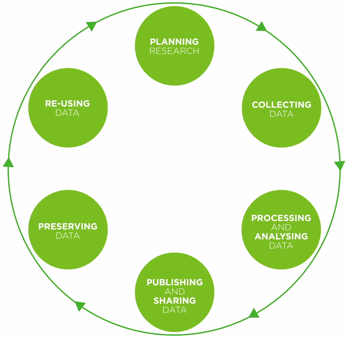

## Thing 1: Getting started with research data

Research data comes in many shapes and sizes and its management changes over time. Kick off your research data journey by exploring different types and forms of research data and how they fit into the research lifecycle.

### Activity 1: What is research data?
What "research data" are we talking about?

1.	Read the [Defining Research Data](https://library.uoregon.edu/research-data-management/best-practices) section from University of Oregon library - note that for data to be reusable the data collection and collation/preparation often needs to include algorithms, scripts, software. It's not 'just data'.
2.	Then open up the dataset details in these repositories:
-	Atlas of Living Australia: [species information about the endangered Corroboree Frog](https://bie.ala.org.au/species/urn:lsid:biodiversity.org.au:afd.taxon:2be14329-b4a1-4fb7-b00f-0ab5d521296d)
-	LTERN: [Connell Rainforest Plot Network, long-term data](https://www.ltern.org.au/knb/metacat/ltern2.32.77/html)
-	TERN-AEKOS: [SWATT leaf carbon isotope ratios](http://aekos.org.au/index.html#/search-results/list/dataset-details-s?datasetId=au.org.aekos.shared.api.model.dataset.SharedSearchResult:351165&q=%5B%7B%22columnNameAekos%22:%22text%22,%22columnNameShared%22:%22text%22,%22operator%22:%22FreeTextBoost%22,%22value%22:%22SWATT%22,%22type%22:%22TEXT%22%7D%5D)
Leaf stable carbon isotope response of terrestrial plants to aridity along a bioclimatic gradient.
-	[Australia’s Environment explorer](http://wenfo.org/ausenv/#/2016/Exposed_soil/Grid/Actual/States_and%20Territories/bar,options/-23.07/135.08/5/none/Roadmap/Opaque): gridded data
-	CSIRO: [Marmion Benthic Survey 2007 data record](https://data.csiro.au/dap/landingpage?pid=csiro:5624&v=1&d=true)

**Consider:** How could complexity and range of data formats affect access and re-use possibilities?

### Activity 2: The data lifecycle
Data often have a longer lifespan than the research project that creates them. Follow-up projects may analyse or add to the data, and data may be reused by other researchers.  

A data lifecycle shows the different phases a dataset goes through as the research project moves from "having a brilliant idea" to "making ground breaking discoveries" to "telling the world about it".

Research Lifecycle Models provide a high-level overview of the stages and actions during the research lifecycle required for successful management of data. Lifecycle diagrams can be very complex, and the complexity is not always related to big data.

1.	Take a look at either:
- [DataOne data lifecycle](https://www.dataone.org/data-life-cycle)
- [UK Data Archive Research Data Lifecycle](https://www.ukdataservice.ac.uk/manage-data/lifecycle)
- [DCC Curation Lifecycle Model](http://www.dcc.ac.uk/resources/curation-lifecycle-model)

**Consider:** What other things impact how data is managed through the lifecycle, e.g. funding policies which make sharing the data mandatory? Have you been through all of the steps outlined in this lifecycle? If not, which ones are new to you?

