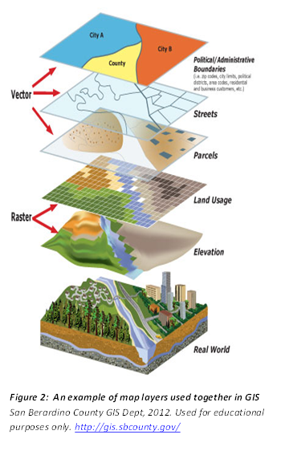

## Thing 10: Spatial data
The importance of spatial data is ever increasing. Many of the societal challenges we face today such as food scarcity and economic growth are inherently linked to big spatial data. In fact, it is often said that 80% of all research data has a geographic or spatial component. It is useful then, for all of us to have an understanding of spatial data.

### Activity 1: Spatial data: maps and more
1.	Start by watching this incredible, inspiring video (3.59 min) from the University of Wollongong’s [PetaJakarta project](https://www.youtube.com/watch?v=6v7BO8_rhWI&feature=youtu.be). It shows innovative ways of combining social media and geospatial data to save lives.
2.	Now read how [GIS can be used in Conservation Biology](https://www.gislounge.com/gis-used-conservation-biology/).
3.	This video combines a range of different data visualisations depicting the [human impacts on our environment](http://spatial.ly/2013/11/climate-change-state-science/).
4.	Geospatial data is fundamental to Australia’s economic future. Check out this very short article about how [GeoScience Australia](http://www.ga.gov.au/news-events/news/latest-news/continental-scale-mapping-of-mineral-potential-wins-top-award) is mapping the mineral potential of our continent - a world first!

Just for fun: Enter your address in the Atlas of Living Australia and see what birds and plants have been reported in your street or suburb. You may be surprised at how ‘alive’ your street is!

**Consider:**  Why do you think these geospatial visualisations are so powerful?

### Activity 2: Spatial Data concepts
There are many types and sources of geospatial data. If you are new to the world of geospatial data, you will probably appreciate some ‘busting’ of the jargon of geospatial data.

1.	Start by reading this [Fundamentals Chapter](https://vcgi.vermont.gov/sites/vcgi/files/training/chapter_1.pdf) to learn more about maps, projections, coordinate systems, datums and GIS.
2.	Want more? Continue with this blog about [Finding and Making Sense of Geospatial Data](https://blog.openshift.com/finding-and-making-sense-of-geospatial-data-on-the-internet/) on the Internet which explains some basic geospatial data file formats and concepts.
3.	Prefer watching? Most of these concepts are also explained in this [video](https://www.youtube.com/watch?v=lelnsbJ7VWo&t=28s).
4.	Read more about two important aspects of spatial data: [scale and resolution](http://desktop.arcgis.com/en/arcmap/latest/manage-data/raster-and-images/cell-size-of-raster-data.htm).

**Consider:** How would you give an explanation of two new terms you have just learnt?

### Activity 3: Using and Visualising Spatial Data
Spatial data can be used in many ways, and there are many tools that you can use to manipulate and display spatial data.

You can try one of the tools below. Do one, or do them all and compare the results.

1.	[13 Free GIS Software Options](https://gisgeography.com/free-gis-software/): Map the World in Open Source            
Browse through this site for ideas for free, open source geospatial software; the descriptions often include discipline specific advice. Download one and try your hand at mapping.
2.	[Spatial data visualisation with R](https://www.r-bloggers.com/spatial-data-visualization-with-r-2/): for those who have done the R modules in Software Carpentry - this might be a good activity to flex your R muscles! Want [more](https://www.researchgate.net/publication/274697165_Spatial_Data_Visualisation_with_R)? Here are some more [R tutorials](http://pakillo.github.io/R-GIS-tutorial/).
3.	Create a map using [Google Fusion Tables](https://support.google.com/fusiontables/answer/2527132?hl=en&ref_topic=2592806): this offers lots of features, but you need a Google account. The excellent Google Fusion tutorial uses butterfly data to show you how to import data, map the data and customise your map.

The [Open Geospatial Consortium (OGC)](http://www.opengeospatial.org/) is an international not-for-profit organization that develops open standards for the geospatial community. OGC through their dedicated global members have developed several standards to share geospatial data. Some of the most commonly use standards are:
- [Web Map Service](http://www.opengeospatial.org/standards/wms) (WMS): a standard web protocol to query and access geo-registered static map images as a web service. The outputs are images that can be displayed in a browser application.
- [Web Feature Service](http://www.e-cartouche.ch/content_reg/cartouche/webservice/en/html/wfs_whatWFSis.html) (WFS): a standard web protocol to query and extract geographic features of a map, these are typically attributes of a map. The latest version of WFS (3.0, Dec 2017) has created [a lot of excitement in the community](https://medium.com/@cholmes/wfs-3-0-get-excited-yes-8e904fdbcc0).
- [Web Coverage Service](http://www.opengeospatial.org/standards/wcs) (WCS): provides access to geospatial information representing phenomena that are variable over space and time, such as satellite images or aerial photos. The service delivers a raster image that can be further interpreted and processed.

[Geoserver](http://geoserver.org/) is the most popular open source reference implementation of WMS, WFS and WCS standards.

**Consider:** The data world is hungry for Geospatial tools and metadata and there is growing demand for people with these skills.  How can these skills be encouraged in your institution?

