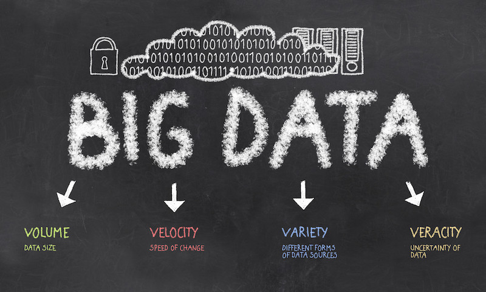

## Thing 2: Issues in research data management

Research data is critical to solving the big questions of our time.  So what are some of the issues we face in managing research data?

### Activity 1: Managing data for reuse
Research data is for everyone. Governments and universities all around Australia and the world are now encouraging researchers to better manage their data so others can re-use it.

Research data might be critical to solving the big questions of our time, but so much data are being lost or poorly managed.

1.	Have a look at the [various case studies](https://data.qld.gov.au/article/case-studies) that show how Queensland Government Data is used in apps that for example can identify areas with air or water pollution, list native plants that are suitable to grow in your area, gather weather information for predictive crop modelling, and more!
2.	Check out [Figure 1 in this paper](https://esajournals.onlinelibrary.wiley.com/doi/full/10.1890/1051-0761%281997%29007%5B0330%3ANMFTES%5D2.0.CO%3B2) to get a quick overview of ‘information entropy’.
3.	This 4.40 minute [cartoon](https://www.youtube.com/watch?v=66oNv_DJuPc) put together by the New York University Health Sciences Library is about what happens when a researcher hasn't managed their data (at all…). What could possibly go wrong!?
As you watch the cartoon jot down the data management mistakes which interest or appal you.
5.	Now, scan through the dot points in the Consider the following…. section of the University of the Sunshine Coast's [Library Guide](http://libguides.usc.edu.au/c.php?g=508408&p=3477838) which provides advice for researchers on how to manage their data.

**Consider:** How just ONE of the data disasters depicted in the cartoon could have been avoided.

### Activity 2: How do you manage “Big Data”?
"Big Data" is a term we are hearing with increasing frequency. Data management for Big Data brings much complexity - citing dynamic data, software, high volume compute, storage costs, transfer of petabytes of data, preservation, provenance, and more.

1.	Read [this post](https://www.linkedin.com/pulse/20140306073407-64875646-big-data-the-5-vs-everyone-must-know/) and presentation titled Big Data: The 5Vs Everyone Must Know.
This article uses 5V's: volume, variety, velocity, veracity and value as a concept for how big data can be managed more successfully.

**Consider:** Your views on whether the concept of 5Vs is useful to support better management and reuse of "Big Data". If you don't think 5Vs is of value, is there another framework or concept model which could be useful for exploring data management for big data?

