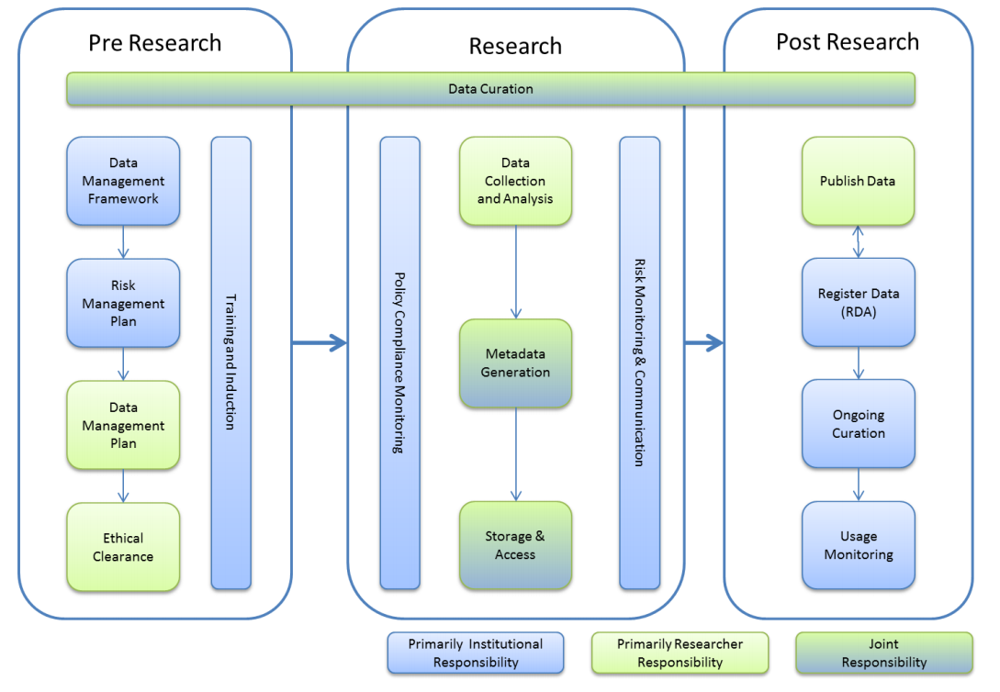

## Thing 4: Data management plans
Some research institutions and research funders now require researchers to submit a Data Management Plan (DMP) for new projects. What is a DMP and what should it cover?

### Activity 1: An introduction to Data Management Plans
A Data Management Plan (DMP) documents how data will be managed, stored and shared during and after a research project. It is an important part of the planning process for a project, and is very helpful when researchers reach later stages of the data lifecycle (see Thing 1, Activity 2).

1.	Start by scanning this short introduction to [Data Management Plans](https://www.ands.org.au/working-with-data/data-management/data-management-plans).
2.	Check out Figure 1 (page 2) in the ANDS [Research Data Management in Practice](http://www.ands.org.au/__data/assets/pdf_file/0009/394056/research-data-management-in-practice.pdf) report to see an overview of where DMPs fit into the bigger picture of data management.
3.	Now browse through some public DMPs using the following links and open up one or two of the DMPs to see the type of information they capture:
- [DMP Tool](https://dmptool.org/public_plans)
- [DataOne](https://www.dataone.org/data-management-planning)
4.	Many Universities have their own guidelines about data management plans, explore one of these or find out if your Institution has one
- [Griffith University](https://www.griffith.edu.au/library/research-publishing/best-practice-guidelines-for-researchers)
- [University of Western Australia](http://guides.library.uwa.edu.au/c.php?g=325196&p=2178556)
- [University of Queensland](https://guides.library.uq.edu.au/for-researchers/uq-research-data-manager/creating-a-dmp)
- Australian National University

**Consider:** You will have noticed that DMPs can be very short, or extremely long and complex. What do you think are the 2 or 3 pieces of information essential to include in every DMP and why that is?

### Activity 2: Data Management Plan Tools
DMP tools enable researchers to create, review, and share data management plans that meet institutional and funder requirements. To make DMPs more useful and effective, these tools are being re-imagined in new ways.

1.	First have a look at the [DMPTool 90 sec video](https://vimeo.com/82408192) to see what the DMPTool offers researchers and institutional data managers.
2.	Then read [this blog](https://blog.dmptool.org/category/roadmap-project/) about how the Digital Curation Centre UK (DCC) and University of California Curation Centre (UCCC) have joined forces to create a new tool, called DMPRoadmap.
3.	Next browse the DMPRoadmap [development wiki](https://github.com/DMPRoadmap/roadmap/wiki) on GitHub.

**Consider:** The DMPRoadmap project is aiming to enable DMP’s to be active, dynamic, machine-readable and [FAIR](https://www.force11.org/group/fairgroup/fairprinciples). Can you think of any additional goals or further enhancements?
