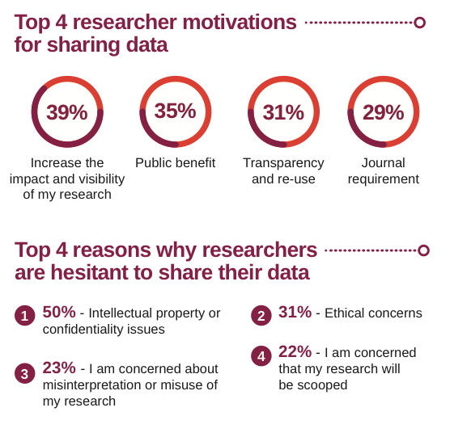

## Thing 6: Data sharing practices
Sharing research data can be beneficial as such data are a valuable resource and in many cases have significant value beyond their original use, such as:
•	It promotes the research and the researchers that created the data.
•	It can lead to re-use, discovery, and increased citation.
•	It can provide an important resource for education and training.
•	It reduces the cost of duplicating or collecting similar data.
•	It maximises transparency and accountability.
•	It can lead to new collaborations between the data creator and user.

Here we are exploring some of the concepts around data sharing, and in Thing 7 we will look at where data can be described and shared.

### Activity 1: An introduction to ‘open’, ‘shared’ and ‘closed’ data
You may have noticed that not all the data described in the repositories in Thing 3 was available for immediate access. This activity explains why different datasets may have different access conditions.

1.	Watch this 2.5 minute [video](https://vimeo.com/125783029) from the Open Data Institute titled Open/Closed/Shared: the world of data.
2.	Now open this page on [Open Data](https://www.ands.org.au/working-with-data/articulating-the-value-of-open-data/open-data) to see a more in-depth view of why data is sometimes open, shared or closed.
3.	Note that the Australian and international conversation around data sharing is now also using the term FAIR (Findable, Accessible, Interoperable, Reusable). Have a look at the ANDS [introduction to FAIR](https://www.ands.org.au/working-with-data/fairdata).
4.	If you have time, go to [Research Data Australia](https://researchdata.ands.org.au/) and try searching for data that is 'open'. Hint: Look for the option to limit your search to data that is Publicly accessible online.

**Consider:** What are some reasons for data to be not publicly accessible or ‘open’?

### Activity 2: Data sharing practices
Repositories are one means by which research data may be shared but in order to get data into repositories, research teams must be willing to publish their data: there are huge differences between data sharing practices by country and by discipline.

1.	Take a look at these infographics from Wiley titled [Research Data Sharing Insights](http://www.acscinf.org/PDF/Giffi-%20Researcher%20Data%20Insights%20--%20Infographic%20FINAL%20REVISED.pdf) (2014), and [Global Data Sharing Trends](http://www.ands.org.au/__data/assets/pdf_file/0011/962282/Wiley-Global-Data-Sharing-Infographic-June-2017.pdf) (2016). They provide a succinct overview of current data sharing practice and perceptions.
2.	Now look closely at the sections titled 'Global Data Sharing Trends' and 'Data Sharing By Discipline'.

**Consider:** Why do you think there are differences between disciplines and countries? What changes over time can you see between the two surveys?

### Activity 3: Sharing sensitive data  
Major, familiar, categories of sensitive data are human data (e.g. health and personal data, secret or sacred practices); or ecological data (may place vulnerable species at risk).

Given the nature of this type of data, you might expect that it can’t be shared and reused. But in many cases, it can be.

1.	Explore the [Sensitive species lists](https://lists.ala.org.au/public/speciesLists?q=sensitive) of the Atlas of Living Australia (ALA): these lists are used to obscure occurrence locations for the species listed to protect them. The location information is stored in ALA, but the general public can only see the associated information of the record and generalised coordinates of the location.
2.	Read this article in [The Conversation](https://theconversation.com/publish-and-dont-perish-how-to-keep-rare-species-data-away-from-poachers-80239) about publishing sensitive data through secure data repositories to help conserve and manage the world’s most threatened species.
3.	How do you share and publish sensitive data?
- Read this article about [Responsible Data Publishing](https://www.tern.org.au/Responsible-data-publishing-bgp4269.html) from TERN.
- Read how the [ALA handles sensitive data](https://www.ala.org.au/how-to-work-with-data/) (towards the bottom of the page).
- Look at the Australian Government Department of Environment’s [Sensitive Ecological Data Access and Management Policy](http://www.environment.gov.au/about-us/environmental-information-data/information-policy/sensitive-ecological-data-access-and-management-policy).
- The NSW Department of Environment, Climate Change and Water [Sensitive Species Policy](https://www.environment.nsw.gov.au/resources/nature/SensitiveSpeciesPolicyDEC09.pdf) manages access to sensitive species locational data by categorisation of sensitive species into 3 groups according to risk status (pages 9-10).
- Scan the ANDS [sensitive data](https://www.ands.org.au/working-with-data/sensitive-data/sharing-sensitive-data) webpage.

**Consider:** What conditions can make ecological data sensitive?
