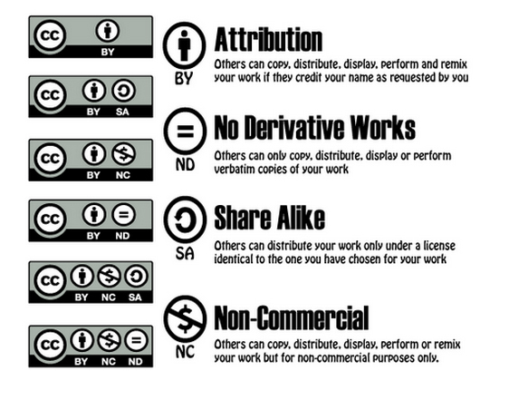

## Thing 9: Licensing data for reuse
Understand the importance of data licensing, learn about Creative Commons and see how licensing data can assist in creating links with business and industry.

### Activity 1: Why license research data?
Consider this scenario: You’ve found a dataset you are interested in. You’ve downloaded it. Excellent! But do you know what you can and cannot do with the data? Alternatively, consider that you have published a dataset. How do you communicate to the secondary user what they can and cannot do with it? The answer lies in data licensing. Licensing is critical to enabling data to be reused and cited.

1.	Start by reading this [brief introduction](https://www.ands.org.au/working-with-data/publishing-and-reusing-data/licensing-for-reuse) to licensing research data.
2.	Now have a closer look at the [poster](http://creativecommons.org.au/content/LicencePoster_Sep20151.pdf) from creativecommons.org.  Click on the descriptions for more information. Notice they have used CC BY as the licensing information at the bottom of the poster so you know what you can do with the poster itself.
3.	Check out the [data licensing policy](https://www.tern.org.au/rs/7/sites/998/user_uploads/File/Data%20Licensing%20Documents/TERN%20Data%20Licensing%20Policy%20v3_0.pdf) and [FAQ](https://www.tern.org.au/TERN-datalicensingfaq-pg26412.html) from TERN.
4.	See what [ALA says about data licensing](https://www.ala.org.au/how-to-work-with-data/).
5.	Check out the [licence chooser](https://creativecommons.org/choose/) from Creative Commons, which walks you through the decision of which licence is appropriate for your purpose.

**Consider:** If you were considering licensing a dataset on something which may have commercial value to others - what licence would you apply?

### Activity 2: Data licences: unlock data for innovation
Enabling reuse of data can speed up research and innovation.  Licensing is critical to enabling data reuse.

1.	Start by watching this 4.30-minute [video](https://www.youtube.com/watch?v=LmyzF7iJp3E&feature=youtu.be&list=PLG25fMbdLRa7QH8_yyNSgzkQOTBVsTK2r) in which Dr Kevin Cullen from the University of New South Wales explains their approach to licensing which aims to strengthen the University’s relationship with business and industry.
2.	Now read the [Australian Government Public Data Policy Statement](https://www.pmc.gov.au/sites/default/files/publications/aust_govt_public_data_policy_statement_1.pdf) (2 pages) that was released by Prime Minister Malcolm Turnbull in December 2015. Note in particular the last dot point.

**Consider:** What are the possible implications for data managers, researchers, librarians and others as we move forward with the [National Science and Innovation Agenda](https://www.industry.gov.au/strategies-for-the-future/boosting-innovation-and-science)? Does your institution have a policy or guidelines around data licensing?

### Activity 3: Data licensing in practice
Not all research data that is shared is licensed for reuse. It should be!

1.	Start by going to [Research Data Australia](https://researchdata.ands.org.au/) and search for research data using keywords e.g. ‘water quality’ or ‘cancer’. Note the number of records in your result set.
2.	Now “Refine Results” to limit your search to only those datasets with an ‘open’ licence.  Note the number of records in this result set.
3.	Look closely at the specific Licensing information on a small sample of those records with ‘open’ licences. How easy or difficult it is to work out if the data can or can’t be reused e.g. for commercial purposes? with international collaborators?

**Consider:** Assigning creative commons licences is not routine. Suggest one tip for encouraging uptake of these licences.

