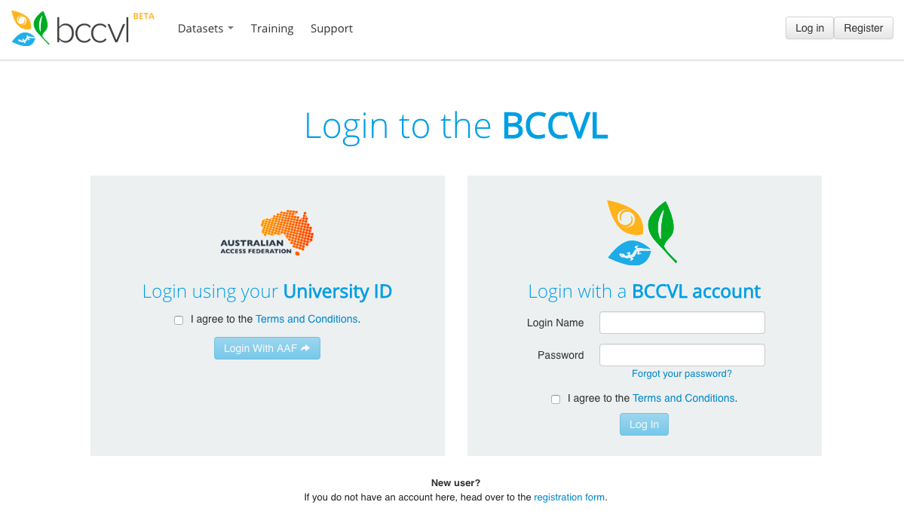

## The Biodiversity and Climate Change Virtual Laboratory
In this workshop you will use a tool that is designed to effectively run Species Distribution Models under current conditions and then project these into the future under different climate change scenarios. This tool, the Biodiversity and Climate Change Virtual Laboratory (BCCVL), uses the national computational infrastructure of Australia, which means that it doesn’t use the computing capacity of your own computer or laptop. You design your experiment in a web-based environment after which the model will be run in the cloud, and you will be notified when the results are ready. One of the major advantages of using the BCCVL is that you don’t need to know any coding! All the experiments use R scripts in the background, but have a user-friendly point-and-click interface so you can focus on the science instead of how to write the script to run a model.

Anyone with an Australian university account can use the BCCVL with his or her own university credentials. Other users can register and create a BCCVL account.

### Log in
1.	Open your web browser (please do not use Internet Explorer as this often gives issues with visualizing maps; Chrome, Firefox or Safari are all ok).
2.	Go to [www.bccvl.org.au](https://www.bccvl.org.au) and click the Login button (top right corner).
3.	This will take you to log in page where you can either use your University credentials (left) or your BCCVL account (right) to log in.
4.	Once logged in you will be taken to the BCCVL welcome page.

