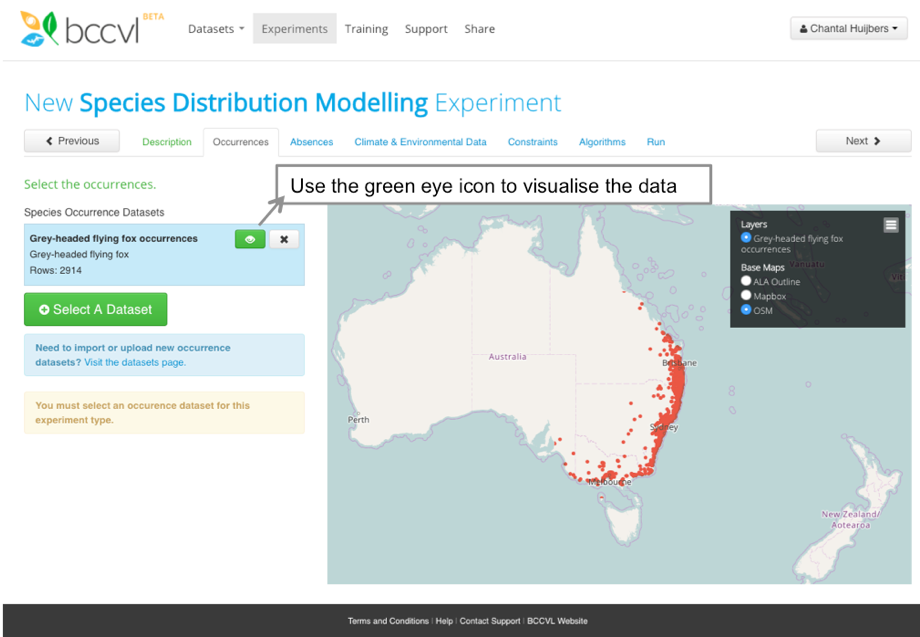

## Running a Species Distribution Model in the BCCVL

In this experiment you will learn to design an SDM to model the potential distribution of a species under current climate and/or environmental conditions. The results of an SDM experiment can later be used in a Climate Change Projection.

You should be logged into the BCCVL. If not, check the [previous step](https://ecoed.github.io/tutorials/modules/SDM-CC/BCCVL.html).

1.	At the top of the page click on <button type="button" name="button" class="btn">Experiments</button>
2.	Under the PRIMARY EXPERIMENTS heading click <button type="button" name="button" class="btn">Species Distribution Modelling Experiment</button>

This will open a page with a set of tabs that will guide you through designing your SDM. The steps below outline what to do on each of these tabs.

### Step 1: Description tab
1.	Enter the name for your experiment in the first box (e.g. Current distribution of Lantana (_Lantana camara_)).
2.	(optional) You can also add a description of your experiment in the box below if you want to convey more information. Some researchers use this box to record their research question or hypotheses for later referral.
3.	Click <button type="button" name="button" class="btn">Next</button>

### Step 2: Occurrences tab
1.	Click Select a Dataset.
2.	Choose your species occurrence dataset and click Select.
3.	To visualise these occurrence records, click on the green eye icon.
4. Click <button type="button" name="button" class="btn">Next</button>

### Step 3: Absences tab
1.	Because we have no surveyed absence data available, we leave the selection to No under the question if you have true absence data for your experiment.
2.	You can change the pseudo-absence generation settings (number of pseudo-absences and generation strategy) or the background generation settings (number of background points) for Maxent in the blue box. All algorithms in the experiment will use these settings unless you change it on the Algorithms tab.
3.	Click <button type="button" name="button" class="btn">Next</button>

### Step 4: Climate and Environmental Data tab
1.	Click Select Available Datasets.
Note: the first selection you will see on this page are so-called summary datasets. These are the most used datasets with aggregated layers over long-term periods. You can immediately select a dataset on the right, or untick the summary datasets box and search through all datasets.
2.	On the left hand side, under ‘Collections’ select ‘Australia current and future climate data’
3.	Find and select the dataset titled ‘Australia, current climate (1976-2005), 30arcsec (~1km)’
4.	Click Select Layers.
5.	Take a minute to review your species information (page 10-11).
Which climate variables are most likely to have the greatest effect on your species?
6.	Check the boxes next to your chosen climate variables.
Tip: You are able to view this data by clicking on the green eye icon.
7.	Click <button type="button" name="button" class="btn">Next</button>

### Step 5: Constraints tab
1.	This tab lets you select the area in which to train your model. This means that only occurrence records from the constraint area are used, and pseudo-absence or background points are only generated in this area.
2.	The default constraint area is the convex hull (minimum polygon) around all occurrence records of the selected species. This convex hull is shown as a blue outline on the map. You can generate a buffer around the convex hull by adding an offset. Other options are:
-	Selecting a pre-defined area, such as a state/territory, IBRA region or NRM region, with or without offset around the selected area. Note: these are Australian only.
-	Using the environmental envelope, which is the geographic extent of where all selected environmental/climate datasets overlap.
-	Draw your own polygon on the map.
-	Upload a shapefile.
3.	Note: in your results you will find two maps with the predicted distribution of your species, one with the projection only in the constraint area and one with the projection for the entire environmental envelope.
4.	Leave this on the default convex hull.
5.	Click <button type="button" name="button" class="btn">Next</button>

### Step 6: Algorithms tab
1.	The BCCVL allows users to run 17 algorithms at the click of a button, in the interest of time please select only 4 algorithms.
Tip: Click on the ‘i’ icon for brief description of each algorithm.
2.	(optional) On the right side you can change the configuration options of each algorithm. For all algorithms the pseudo-absence generation settings as set on the Absence tab will be used unless changed here.
3.	Click <button type="button" name="button" class="btn">Next</button>

### Step 7: Run tab
1.	If all tabs are green then your experiment is ready to go.
2.	Click <button type="button" name="button" class="btn">Start Experiment</button>
3.	If any of your tabs are red, revisit it and ensure you have filled in each component correctly.
